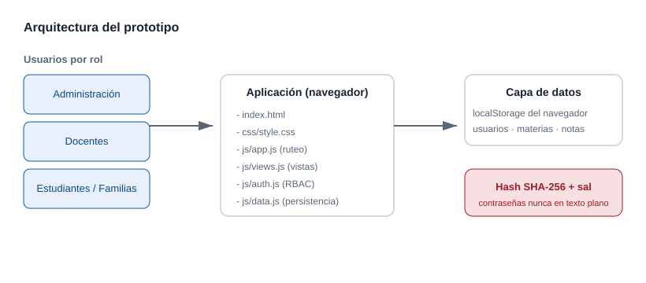
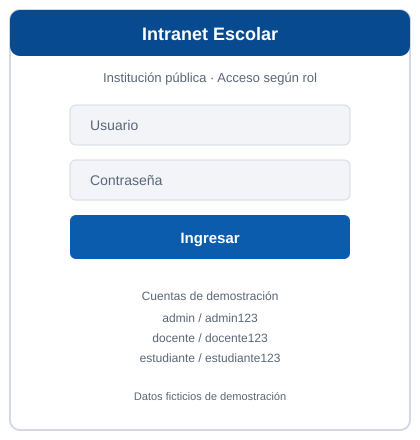

# Arquitectura del Sistema

Documento técnico con las decisiones de diseño, el stack tecnológico y los diagramas del prototipo de la **Intranet Escolar**.

## Contexto

El prototipo debe ser **ejecutable localmente sin instalaciones adicionales** (RNF-03 y objetivos del proyecto). Por eso se eligió un frontend puro con persistencia en el navegador, sin servidor ni dependencias externas. Esta decisión simplifica la instalación y permite presentar las funcionalidades centrales (roles, calificaciones, comunicados) sin infraestructura.

## Stack tecnológico

- **HTML5** — estructura de la interfaz en `index.html`.
- **CSS3** — estilos y accesibilidad en `css/style.css`.
- **JavaScript (ES5 compatible)** — lógica de aplicación, sin librerías externas.
- **localStorage** — persistencia de datos de demostración en el navegador.
- **GitHub Flavored Markdown (GFM)** — toda la documentación.

No se utilizan frameworks ni herramientas de compilación. Los archivos se cargan en orden y cada uno expone un módulo global (`SHA256`, `DB`, `Auth`, `Views`).

## Diagrama de arquitectura

La aplicación es una **SPA** (Single Page Application): `index.html` contiene un contenedor (`#app`) y `js/app.js` se encarga del ruteo mediante el hash de la URL y del montaje de cada vista.

## Modelo de roles y permisos

El control de acceso está centralizado en `js/auth.js`. Cada rol tiene un conjunto de vistas permitidas:

| Vista | Administración | Docentes | Estudiantes / Familias |
| :--- | :---: | :---: | :---: |
| Inicio | Sí | Sí | Sí |
| Comunicados | Sí | Sí | Sí |
| Calificaciones | Sí | Sí | Sí |
| Asistencia | Sí | Sí | Sí |
| Horario | Sí | No | Sí |
| Usuarios | Sí | No | No |
| Mi perfil | Sí | Sí | Sí |

El menú lateral se construye dinámicamente con las vistas permitidas (RF-05), de modo que un usuario nunca ve opciones a las que no tiene acceso.

## Modelo de datos

La capa de datos (`js/data.js`) persiste un único documento JSON en `localStorage` con las siguientes colecciones:

- `users` — cuentas del sistema. Las contraseñas se guardan como `passwordHash` (SHA-256 con sal) y **nunca** en texto plano (RNF-02).
- `subjects` — materias y curso asociado.
- `grades` — calificaciones por estudiante, materia y período.
- `attendance` — registros de asistencia por estudiante, materia y fecha.
- `notices` — comunicados con audiencia (`all`, `teacher`, `student`).
- `schedule` — horarios por curso.

## Seguridad de contraseñas

Decisión: implementar SHA-256 en `js/sha256.js` con **sal aleatoria por usuario**. Se elige un hash en el cliente porque el prototipo no tiene servidor, garantizando que el valor almacenado nunca sea la contraseña original.

- La sal se genera con `DB.randomSalt()` en `js/data.js`.
- El hash se calcula con `hashPassword(salt, password)`.
- La verificación compara el hash del intento contra el almacenado.

**Limitación conocida:** en un despliegue real este esquema debe moverse al servidor, usando bcrypt o argon2 con factor de trabajo, HTTPS y sesiones. Se documenta en `CHANGELOG.md` como trabajo pendiente.

## Accesibilidad (RNF-01)

- Contraste de colores AA entre texto y fondo (ver paleta en `css/style.css`).
- Etiquetas explícitas asociadas a cada campo de formulario (`<label for="...">`).
- Enlace de salto al contenido (`skip-link`) y navegación por teclado.
- Indicador de foco visible (`:focus-visible`) y estados `aria-live` para mensajes de error.

## Diseño de módulos

- `js/sha256.js` — implementación local de SHA-256 (sin dependencias).
- `js/data.js` — lectura/escritura de `localStorage`, semilla de demostración y helpers.
- `js/auth.js` — login, logout, sesión y permisos por rol.
- `js/views.js` — renderizado de cada vista y gestión de eventos.
- `js/app.js` — ruteo por hash, montaje de la aplicación y sesión.

Cada módulo es una IIFE que expone un objeto global. Esto mantiene el alcance limpio y las responsabilidades separadas sin usar un bundler.
